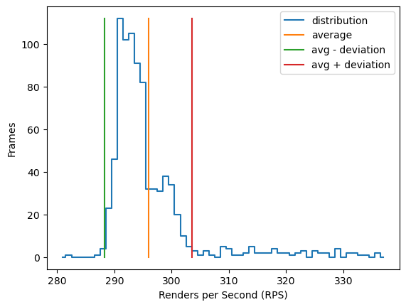
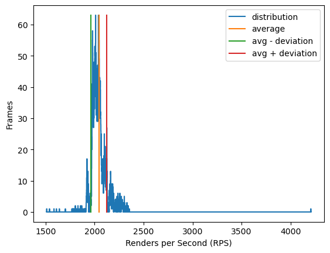

# Измерение прироста производительности с использованием SIMD в задаче alpha blending-а
## Введение
Рассмотрим задачу наложения по прозрачности с использованием линейной интерполяции по прозрачности накладываемого изображения.

Программа получает на вход два растровых изображения, хотя бы одно из которых имеет канал прозрачности. Требуется наложить "прозрачное" изображение на непрозрачное, используя алгоритм попиксельного линейного смешения.

Введём следующие термины:
 * фоновое изображение, фон - входное непрозрачное изображение
 * накладываемое изображение - входное изображение с каналом прозрачности
 * результирующее изображение - изображение, полученное наложением накладываемого изображения на фон

Формула для расчёта цвета пикселя результирующего изображения:

$\text{FinalColor}=\frac{\text{ForegroundColor}\cdot\text{ForegroundAlpha}+\text{BackgroundColor}(255-\text{ForegroundAlpha}))}{256}$

где
 * $\text{FinalColor}$ - цвет пикселя результирующего изображения,
 * $\text{ForegroundColor}$ - цвет пикселя накладываемого изображения в виде вектора в пространстве RGBA, 
 * $\text{ForegroundAlpha}$ - прозрачность пикселя накладываемого изображения (предполагается, что $0\leq\text{ForegroundAlpha}\leq255$, гдe 0 соответствует полностью прозрачному пикселю, а 255 - непрозрачному),
 * $\text{BackgroundColor}$ - цвет пикселя фона (в пространстве RGBA).

Классическое решение данной задачи предполагает написание цикла по пикселям результирующего изображения, с обработкой одного пикселя за итерацию цикла. Данную реализацию можно ускорить, применив SIMD для параллельной обработки нескольких пикселей за итерацию.

Целью данного эксперимента является определение ускорения, даваемого SIMD в смешении изображений по прозрачности.

## Методы исследования
Исследование проводилось на одной программе, реализующей смешение двух изображений (исходные изображения находятся в папке [assets/images/..](./assets/images/)) на экране 800x600 пикселей. Оба изображения были выравнены по верхнему левому углу экрана. Далее запускался цикл по всем пикселям экрана, на каждой итерации которого выполнялись следующие действия:
 1. Если пиксель не попадает в границы фонового изображения, перейти к следующей итерации цикла.
 2. Если пиксель попадает в границы фонового изображения, но не попадает в границы накладываемого изображения, выполнить копирование данных цвета пикселя с фона на экран
 3. Если пиксель попадает как в границы фонового изображения, так и в границы накладываемого изображения, выполнить смешение цветов соответствующих пикселей фона и накладываемого изображения и присвоить результат цвету пикселя экрана.

Переключение между реализациями функции смешения цветов проводились на этапе компиляции в зависимости от наличия флага `-D USE_SIMD`.

Для уменьшения влияния на результат эксперимента таких действий программы, как обновление экрана и обработка событий, рендер результирующего изображение происходил 128 раз перед каждым обновлением экрана. Отсюда возникла необходимость измерять не FPS, a RPS (Renders Per Second), который в 128 раз больше FPS.

RPS высчитывался после каждого обновления экрана и записывался в гистограмму, которая по завершении работы программы экспортировалась в таблицу в формате CSV и использовалась для подсчёта среднего значения RPS реализации.

Расчёт коэффициента ускорения $K$ производился по формуле

$K=\frac{\text{SIMDRPS}}{\text{NoSIMDRPS}}$

Где
 * $\text{SIMDRPS}$ - RPS SIMD-ускоренной версии
 * $\text{NoSIMDRPS}$ - RPS неускоренной версии

Условия компиляции:
 - Версия GCC: *(Ubuntu 11.3.0-1ubuntu1~22.04) 11.3.0*
 - Флаги компилятора: `-D _DEBUG -D EXPERIMENT -ggdb3 -std=c++2a -O2 -march=corei7 -mavx2 -pie -lglut -lGLU -lGL`

Условия запуска:
 - Тестирование производилось на ноутбуке, подключённым к электросети (т.е. уменьшение производительности в связи с энергосберегающим режимом отсутствует)
 - CPU: 11th Gen Intel i7-1165G7 (8) @ 4.700GHz
 - OS: Linux Mint 20.3 x86_64
 - Макс. температура процессора во время тестирования: без SIMD: 86, с SIMD: 90 градусов Цельсия (возможен throttling)

## Результаты
Результаты измерений были сохранены в файлах [rps_no_simd.csv](./measurement/rps_no_simd.csv) (для неускоренной версии) и [rps_simd.csv](./measurement/rps_simd.csv) (для SIMD-ускоренной версии)

Обработка результатов измерений была проведена в файле [result_processing.ipynb](./measurement/result_processing.ipynb)

RPS неускоренной версии: $296 \pm 8$ рендера в секунду

|  |
| --- |
| *Фигура 1: гистограмма RPS неускоренной версии* |

RPS SIMD-ускоренной версии: $2043 \pm 80$ рендера в секунду

|  |
| --- |
| *Фигура 2: гистограмма RPS SIMD-ускоренной версии* |

Коэффициент ускорения: $6.9 \frac{1 \pm 0.039}{1 \pm 0.026} \simeq 6.9 \pm 0.4$

## Заключение и обсуждение
Ускорение приблизилось к своему теоретическому пределу (8 раз для AVX). Нехватка может быть объяснена дополнительными затратами на обращения к памяти, обновление экрана и обработку событий.

Ускорение может быть объяснено анализом кода функции смешения цветов на языке assembly ([code on godbolt.org](https://godbolt.org/z/oE7bMfjh5)):

Базовая, не SIMD-ускоренная реализация:
```c++
// [IN] foreground - foreground pixel color in RGBA32 representation
// [IN] background - background pixel color in RGBA32 representation
// [OUT] result - resulting color of the pixel in RGBA32 representation
void mix_colors_no_simd(uint8_t foreground[4], uint8_t background[4], uint8_t result[4]) {
    for (int channel = 0; channel < 4; ++channel) {
        result[channel] = (uint8_t) (((int) foreground[channel] * foreground[3] +
            (int) background[channel] * (255 - foreground[3])) >> 8);
    }
}
```
*Листинг 1: реализация смешения цветов без SIMD на языке C++*

```asm
mix_colors_no_simd(unsigned char*, unsigned char*, unsigned char*):
        mov     r9, rdi
        xor     eax, eax
        mov     r10d, 255
.L2:
        movzx   r8d, BYTE PTR [r9+3]
        movzx   ecx, BYTE PTR [rsi+rax]
        mov     edi, r10d
        sub     edi, r8d
        imul    ecx, edi
        movzx   edi, BYTE PTR [r9+rax]
        imul    edi, r8d
        add     ecx, edi
        mov     BYTE PTR [rdx+rax], ch
        add     rax, 1
        cmp     rax, 4
        jne     .L2
        ret
```
*Листинг 2: реализация смешения цветов без SIMD на языке assembly (nasm)*
    
SIMD-ускоренная реализация
```c++
// [IN] back - 256-byte integer vector of RGBA32 pixels of the background
// [IN] front - 256-byte integer vector of RGBA32 pixels of the foreground
// return - 256-byte integer vector of RGBA32 pixels of the resulting image
__m256i mix_colors(__m256i back, __m256i front) {
    const char O = 0, I = (char) 255, Z = (char) 0x80;
    const __m256i LEFT_SPLIT = _mm256_set_epi8(
    Z, 29, Z, 28,  Z, 25, Z, 24,  Z, 21, Z, 20,  Z, 17, Z, 16,  Z, 13, Z, 12,  Z, 9, Z, 8,    Z, 5, Z, 4,  Z, 1, Z, 0
    );
    const __m256i RIGHT_SPLIT = _mm256_set_epi8(
    Z, 31, Z, 30,  Z, 27, Z, 26,  Z, 23, Z, 22,  Z, 19, Z, 18,  Z, 15, Z, 14,  Z, 11, Z, 10,  Z, 7, Z, 6,  Z, 3, Z, 2
    );
    const __m256i ALPHA_EXTRACTOR = _mm256_set_epi8(
    Z, 31, Z, 31,  Z, 27, Z, 27,  Z, 23, Z, 23,  Z, 19, Z, 19,  Z, 15, Z, 15,  Z, 11, Z, 11,  Z, 7, Z, 7,  Z, 3, Z, 3
    );
    const __m256i WHITE = _mm256_set_epi8(
    O, I, O, I,    O, I, O, I,    O, I, O, I,    O, I, O, I,    O, I, O, I,    O, I, O, I,    O, I, O, I,  O, I, O, I
    );

    const __m256i ASSEMBLE_LEFT = _mm256_set_epi8(
    Z, Z, 31, 29,  Z, Z, 27, 25,  Z, Z, 23, 21,  Z, Z, 19, 17,  Z, Z, 15, 13,  Z, Z, 11, 9,  Z, Z, 7, 5,  Z, Z, 3, 1
    );
    const __m256i ASSEMBLE_RIGHT = _mm256_set_epi8(
    31, 29, Z, Z,  27, 25, Z, Z,  23, 21, Z, Z,  19, 17, Z, Z,  15, 13, Z, Z,  11, 9, Z, Z,  7, 5, Z, Z,  3, 1, Z, Z
    );


    __m256i back_left   = _mm256_shuffle_epi8(back,  LEFT_SPLIT);
    __m256i back_right  = _mm256_shuffle_epi8(back,  RIGHT_SPLIT);
    __m256i front_left  = _mm256_shuffle_epi8(front, LEFT_SPLIT);
    __m256i front_right = _mm256_shuffle_epi8(front, RIGHT_SPLIT);

    __m256i alpha_front = _mm256_shuffle_epi8(front, ALPHA_EXTRACTOR);
    __m256i alpha_front_inverse = _mm256_sub_epi8(WHITE, alpha_front);

    __m256i final_left  = _mm256_add_epi8(_mm256_mullo_epi16(front_left,  alpha_front),
                                          _mm256_mullo_epi16(back_left,   alpha_front_inverse));
    __m256i final_right = _mm256_add_epi8(_mm256_mullo_epi16(front_right, alpha_front),
                                          _mm256_mullo_epi16(back_right,  alpha_front_inverse));

    return _mm256_add_epi8(_mm256_shuffle_epi8(final_left,  ASSEMBLE_LEFT),
                           _mm256_shuffle_epi8(final_right, ASSEMBLE_RIGHT));
}
```
*Листинг 3: реализация смешения цветов c SIMD на языке C++*

```asm
mix_colors(long long __vector(4), long long __vector(4)):
        vmovdqa ymm3, YMMWORD PTR .LC0[rip]
        vmovdqa ymm2, YMMWORD PTR .LC1[rip]
        vpshufb ymm5, ymm0, ymm3
        vpshufb ymm4, ymm1, ymm3
        vpshufb ymm0, ymm0, ymm2
        vpshufb ymm3, ymm1, ymm2
        vmovdqa ymm2, YMMWORD PTR .LC3[rip]
        vpshufb ymm1, ymm1, YMMWORD PTR .LC2[rip]
        vpmullw ymm3, ymm1, ymm3
        vpsubb  ymm2, ymm2, ymm1
        vpmullw ymm1, ymm1, ymm4
        vpmullw ymm0, ymm2, ymm0
        vpmullw ymm2, ymm2, ymm5
        vpaddb  ymm0, ymm0, ymm3
        vpaddb  ymm1, ymm1, ymm2
        vpshufb ymm0, ymm0, YMMWORD PTR .LC4[rip]
        vpshufb ymm1, ymm1, YMMWORD PTR .LC5[rip]
        vpaddb  ymm0, ymm0, ymm1
        ret
.LC0: [LEFT_SPLIT      vector, defined as sequence of .byte-s]
.LC1: [RIGHT_SPLIT     vector, defined as sequence of .byte-s]
.LC2: [ALPHA_EXTRACTOR vector, defined as sequence of .byte-s]
.LC3: [WHITE           vector, defined as sequence of .byte-s]
.LC4: [ASSEMBLE_RIGHT  vector, defined as sequence of .byte-s]
.LC5: [ASSEMBLE_LEFT   vector, defined as sequence of .byte-s]
; .LC0 - .LC5 blocks were shortened for convenience purposes
```
*Листинг 4: реализация смешения цветов c SIMD на языке assembly (nasm)*

Как можно заметить, без SIMD-оптимизации функция может обработать лишь один пиксель за вызов, причём с использованием внутреннего цикла по каналам.

SIMD же позволяет реализовать функцию, принимающую и обрабатывающую параллельно все каналы 8 пикселей (32 числа), что значительно ускоряет работу программы.

Также следует обратить внимание на то, что в SIMD-ускоренной версии программы происходило в 8 раз меньше вызовов `memcpy`, что связано с увеличенным в 8 раз сдвигом счётчика цикла, необходимым для параллелизации. Различия показаны в листингах 5, 6.

```c++
for (unsigned pixel_x = 0; pixel_x < SCREEN_WIDTH; pixel_x++) {
    for (unsigned pixel_y = 0; pixel_y < SCREEN_HEIGHT; pixel_y++) {

        . . .

        if (...) memcpy(...);

        . . .

    }
}
```
*Листинг 5: макет цикла неускоренной версии на языке C++*

```c++
for (unsigned pixel_x = 0; pixel_x < SCREEN_WIDTH; pixel_x += 8) {
    for (unsigned pixel_y = 0; pixel_y < SCREEN_HEIGHT; pixel_y++) {

        . . .

        if (...) memcpy(...);

        . . .

    }
}
```
*Листинг 6: макет цикла SIMD-ускоренной версии на языке C++*

Работа показывает, что SIMD - хороший способ оптимизации программ, требующих параллелизации без разделения на потоки или использования графических ускорителей.
